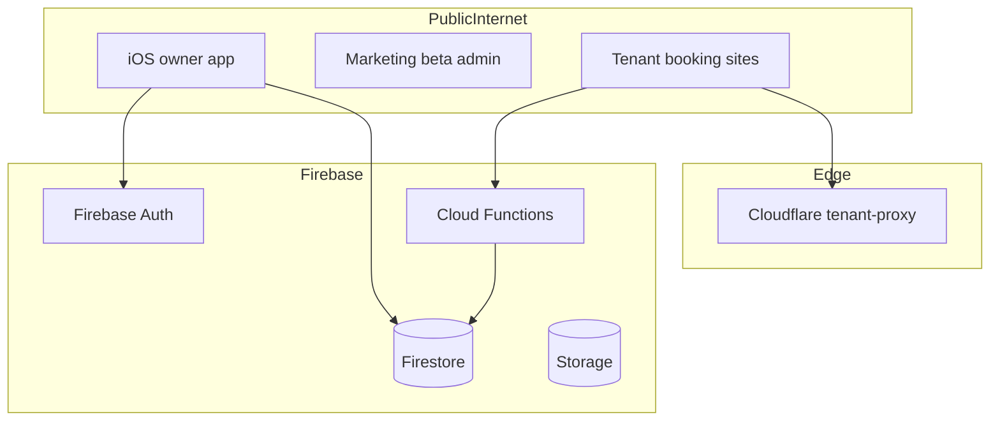

# Get Bookking — Security Audit Report

**Date:** 2026-08-24  
**Scope:** Repository + architecture review (read-only). No production penetration testing. No code changes.  
**Project:** Firebase `test-app-96812` — iOS app, public tenant sites, Cloud Functions, Firestore/Storage rules, Cloudflare tenant proxy.

---

## Executive summary

Get Bookking’s security posture is **mixed**. Server-side payment and admin flows generally use Firebase secrets, Stripe webhook signature verification, and beta-admin UID allowlists correctly. Firestore rules protect **writes** to sensitive billing/SMS fields.

However, several **authorization gaps in Firestore rules** could allow cross-tenant data access and storage abuse if exploited via the public Firebase client SDK. Public Cloud Functions lack **App Check, CAPTCHA, and rate limiting**, creating spam and cost-abuse vectors. Dependency scanning found **29 npm vulnerabilities** (2 critical) in the Cloud Functions dependency tree.

**Overall risk:** **High** until Firestore user-create rules and storage upload rules are hardened. Automated security tooling is not present in CI.

---

## Methodology

| Phase | Activity |
|-------|----------|
| 1 | `npm audit` on [`functions/package.json`](../functions/package.json) |
| 2 | Pattern scan for secrets (`sk_live`, `sk_test`, `whsec_`, private keys, hardcoded passwords) |
| 3 | Git history spot-check (`git log -S` for `sk_live`, `whsec_`, `STRIPE_SECRET`) |
| 4 | Manual review of [`firestore.rules`](../firestore.rules), [`storage.rules`](../storage.rules) |
| 5 | Manual review of public Cloud Functions in [`functions/index.js`](../functions/index.js), [`functions/betaAdmin.js`](../functions/betaAdmin.js), [`functions/customDomain.js`](../functions/customDomain.js) |
| 6 | Web/hosting review: [`firebase.json`](../firebase.json), [`web/index.html`](../web/index.html), marketing admin pages |
| 7 | iOS secrets handling: [`Test/SecretsManager.swift`](../Test/SecretsManager.swift), [`Test/PrivacyInfo.xcprivacy`](../Test/PrivacyInfo.xcprivacy) |

**Not performed:** Live exploitation against `*.getbookking.com`, Firebase Auth abuse testing, or dynamic DAST.

---

## Automated scan results

### npm audit (`functions/`)

```
29 vulnerabilities (2 low, 14 moderate, 11 high, 2 critical)
```

| Severity | Package | Notes |
|----------|---------|-------|
| **Critical** | `protobufjs` | Via `firebase-admin` → `@google-cloud/firestore` → `google-gax` (production runtime) |
| **Critical** | `websocket-driver@0.7.4` | Via `firebase-admin` → `@firebase/database` → `faye-websocket` (production runtime) |
| **High** | `@grpc/grpc-js`, `axios`, `lodash`, `node-forge`, `fast-xml-parser`, others | Mostly transitive; several under `firebase-admin` / `firebase-functions` |

**Remediation:** Run `npm audit fix` where non-breaking; plan `firebase-admin` major upgrade (audit suggests `14.3.0` for some paths). Add `npm audit` to CI with fail-on-high threshold.

### Secret / credential scan

| Finding | Location | Severity |
|---------|----------|----------|
| Firebase Web API key (committed) | [`web/js/firebase-config.js`](../web/js/firebase-config.js), marketing configs | **Info** — expected for client apps; security boundary is rules + Auth |
| Stripe **test** publishable key (committed) | `web/js/firebase-config.js`, `web/marketing/js/firebase-config.js` | **Info** — publishable keys are designed to be public |
| Demo passwords in repo | `BookkingDemo2026!`, `1Abcdefg!` in [`scripts/seed-demo-accounts.js`](../scripts/seed-demo-accounts.js), [`scripts/invite-team-members-via-join.js`](../scripts/invite-team-members-via-join.js) | **Medium** — rotate if used in any non-local environment |
| Firebase CLI OAuth client secret | `j9iVZfS8kkCEFUPaAeJV0sAi` in multiple [`scripts/`](../scripts/) files | **Low** — this is the public Firebase CLI client ID secret (not a server API key); still prefer env-only |
| No `sk_live`, `whsec_`, or private keys in tracked source | — | **Pass** |
| Git history spot-check | No `sk_live` in history; `whsec_` only in old commits removing `node_modules` | **Pass** (no live secrets found) |

**gitleaks:** Not installed in audit environment. Recommend adding to CI.

### CI / tooling gaps

- Only workflow: [`.github/workflows/firebase-hosting-pull-request.yml`](../.github/workflows/firebase-hosting-pull-request.yml) (Hosting previews)
- **Missing:** Dependabot, CodeQL, gitleaks, `npm audit`, Firestore rules unit tests

---

## Findings

### Critical

#### BK-001 — Cross-tenant access via unrestricted `users/{uid}` create

**Component:** [`firestore.rules`](../firestore.rules) lines 100–106  
**Description:** `users/{uid}` allows `create` for any signed-in user with **no field restrictions**. Protected keys (`tenantId`, `role`, `stripeAccountId`, etc.) are only enforced on **update** via `userProtectedKeysUnchanged()`.

**Exploit scenario:**
1. Attacker creates a Firebase Auth account.
2. Before or instead of legitimate provisioning, they create `users/{theirUid}` with `tenantId` set to a victim tenant’s ID (and optionally `role` / `accessRole`).
3. `canManageTenant(victimTenantId)` becomes true via `userTenantIdMatches()`.
4. Attacker gains read/write to `tenants/{id}/bookingRequests`, `customers`, `services`, `products`, `shopOrders`, and non-money tenant fields.

**Evidence:**

```100:106:firestore.rules
    match /users/{uid} {
      allow read: if isSignedIn() && request.auth.uid == uid;
      allow create: if isSignedIn() && request.auth.uid == uid;
      allow update: if isSignedIn()
        && request.auth.uid == uid
        && userProtectedKeysUnchanged();
```

**Recommendation:** On `create`, deny client writes of all protected keys (or require `create` to only allow a safe subset). Prefer **server-only** user document creation via Admin SDK after signup/invite acceptance. Add rules unit tests for this path.

---

### High

#### BK-002 — Full tenant documents are publicly readable

**Component:** [`firestore.rules`](../firestore.rules) line 154  
**Description:** `match /tenants/{tenantId} { allow read: if true; }` exposes the **entire** tenant document to anyone with the Firebase API key.

**Exposed fields (examples):** `stripeAccountId`, `stripeCustomerId`, `stripeSubscriptionId`, `twilioMessagingServiceSid`, `twilioSubaccountSid`, `smsPhoneNumber`, `subscriptionPlan`, `subscriptionStatus`, `ownerUid`, SMS usage counters.

**Note:** `stripeAccountId` is intentionally used by the booking web app for Stripe Connect checkout. Other fields are not needed client-side.

**Recommendation:** Split into `tenantsPublic/{id}` (branding, slug, services metadata) vs private tenant doc (server-only), or use field-level security / callable proxies for checkout.

---

#### BK-003 — Beta bug attachment IDOR (Storage)

**Component:** [`storage.rules`](../storage.rules) lines 42–49  
**Description:** `betaBugAttachments/{uid}/{uploadId}/{filename}` allows **read for any authenticated user** (`request.auth != null`), not just the owning `uid`.

**Exploit scenario:** Any beta tester who signs in can read other testers’ bug report images/videos/PDFs.

**Recommendation:** Change read rule to `request.auth.uid == uid`.

---

#### BK-004 — Reference image upload abuse (Storage)

**Component:** [`storage.rules`](../storage.rules) lines 17–22  
**Description:** `tenantRefImages/{tenantId}/...` allows any authenticated user (including **Anonymous Auth**) to upload up to 5 MB images to **any** `tenantId` without membership check.

**Exploit scenario:** Storage flooding, cost abuse, or polluting a tenant’s booking intake uploads.

**Recommendation:** Validate tenant slug via callable before upload, use signed upload URLs, or require App Check + rate limits.

---

#### BK-005 — No App Check or rate limiting on public callables

**Component:** [`functions/index.js`](../functions/index.js)  
**Description:** Multiple unauthenticated or public-invoker endpoints have no rate limiting, reCAPTCHA, or Firebase App Check:

| Function | Risk |
|----------|------|
| `createBookingRequestFromWeb` | Booking spam, notification/SMS side effects |
| `createShopOrderFromWeb`, `getShopShippingRates`, `createShopCheckoutPayment` | Shippo API cost abuse, order spam |
| `createCharterCheckoutPayment`, `finalizeCharterBookingPayment` | Payment intent probing |
| `submitBetaWaitlist` | Waitlist spam (honeypot only) |
| `sendPasswordResetLink` | Email bombing via Resend |
| `publicWebCallableOptions` / `publicShopCallableOptions` (`invoker: "public"`, `cors: true`) | Broad CORS + anonymous invocation |

**Recommendation:** Enable Firebase App Check on web/iOS, add per-IP rate limits (Cloud Armor, Redis, or Firebase extensions), and CAPTCHA on high-abuse endpoints.

---

#### BK-006 — Production dependency vulnerabilities

**Component:** `functions/node_modules` (via `firebase-admin`)  
**Description:** `npm audit` reports 2 **critical** and 11 **high** issues, including `protobufjs` and `websocket-driver` in the `firebase-admin` production tree.

**Recommendation:** `npm audit fix`, upgrade `firebase-admin` when compatible, monitor advisories. Add CI gate.

---

### Medium

#### BK-007 — Twilio webhook signature validation is optional

**Component:** [`functions/index.js`](../functions/index.js) ~13464  
**Description:** `twilioInboundSms` only validates `X-Twilio-Signature` when `authToken && sig && url` are all truthy. If misconfigured, requests may be processed unsigned.

**Recommendation:** Fail closed — return 403 if signature cannot be validated.

---

#### BK-008 — Unauthenticated password reset email sender

**Component:** [`functions/index.js`](../functions/index.js) ~13683  
**Description:** `sendPasswordResetLink` is public (no auth). User enumeration is mitigated (`auth/user-not-found` returns `{ ok: true }`), but attackers can still trigger reset emails to arbitrary addresses (email bombing / Resend cost).

**Recommendation:** Rate limit per IP/email; consider Firebase Auth’s built-in email flow only.

---

#### BK-009 — Domain resolve exposes internal `tenantId`

**Component:** [`functions/customDomain.js`](../functions/customDomain.js) ~2015  
**Description:** Public `resolveTenantDomain` returns `{ ok, host, slug, tenantId, status }`. Needed for Cloudflare worker routing but aids reconnaissance.

**Recommendation:** Return only `slug` to public callers if `tenantId` is not required client-side.

---

#### BK-010 — Incomplete Content-Security-Policy

**Component:** [`firebase.json`](../firebase.json)  
**Description:** Booking hosting sets only `frame-ancestors` CSP. Marketing target has **no CSP**. No `script-src`, `default-src`, or `object-src` restrictions on either site.

**Recommendation:** Add strict CSP for marketing admin and booking sites; use nonces or hashes for inline scripts where needed.

---

#### BK-011 — Default demo passwords in repository

**Component:** [`scripts/seed-demo-accounts.js`](../scripts/seed-demo-accounts.js), [`scripts/README-demo-accounts.md`](../scripts/README-demo-accounts.md)  
**Description:** Default `BookkingDemo2026!` and `1Abcdefg!` documented and used by seed scripts.

**Recommendation:** Require `DEMO_ACCOUNT_PASSWORD` env var with no default in non-local runs; ensure demo tenants stay `isDemoAccount: true` (booking callable already blocks demo writes).

---

### Low / Informational

#### BK-012 — Committed client configuration keys

**Component:** [`web/js/firebase-config.js`](../web/js/firebase-config.js)  
**Severity:** Info  
Firebase API keys and Stripe publishable test keys are public by design. Ensure Firebase Console API key restrictions and Firestore rules remain the enforcement layer.

---

#### BK-013 — No automated security pipeline

**Severity:** Info  
No gitleaks, npm audit, CodeQL, or Firestore rules tests in CI.

---

#### BK-014 — Legacy iOS REST client unused

**Component:** [`Test/APIService.swift`](../Test/APIService.swift)  
**Description:** Defines `/admin/login` REST calls but is **never referenced** elsewhere in the iOS target (Firebase Auth is used instead). Dead code reduces clarity.

---

#### BK-015 — XSS posture on public web (generally good)

**Component:** [`web/index.html`](../web/index.html)  
**Description:** Dynamic HTML uses `esc()` helper consistently for tenant copy, team roster names, charter times, and booking summaries. Marketing admin uses `BetaAdmin.escapeHtml()` in detail views.  
**Residual risk:** Large `innerHTML` templates (`form()`, `teamPage()`) build HTML from tenant-controlled Firestore fields; a malicious **tenant owner** could inject script via fields if any interpolation omits `esc()`. Full template audit recommended before allowing untrusted tenants.

---

## Strengths observed

| Area | Detail |
|------|--------|
| Stripe webhooks | `stripe.webhooks.constructEvent` with `rawBody` check ([`functions/index.js`](../functions/index.js) ~7778) |
| Beta admin | UID allowlist + `platformAdmin` custom claim ([`functions/betaAdmin.js`](../functions/betaAdmin.js) `assertPlatformAdmin`) |
| Money field writes | `tenantMoneyKeysUnchanged()` / `userProtectedKeysUnchanged()` block client Stripe/SMS mutations |
| Admin collections | `betaWaitlist`, `tenantInvites`, `paymentLedger` — client deny all |
| Team invites | `acceptTenantInvite` uses transaction + seat limits + plan checks |
| iOS secrets | `Secrets.plist` gitignored; [`SecretsManager.swift`](../Test/SecretsManager.swift) loads from bundle |
| Privacy manifest | [`Test/PrivacyInfo.xcprivacy`](../Test/PrivacyInfo.xcprivacy) declares email, name, phone, photos, location, user ID |
| Password reset | Does not reveal whether email exists (`auth/user-not-found` → `{ ok: true }`) |
| Beta waitlist | Honeypot `website` field on `submitBetaWaitlist` |

---

## Public API surface (unauthenticated callables)

Functions callable **without** `context.auth` check (intentional public endpoints):

| Export | Auth | Notes |
|--------|------|-------|
| `getDemoAppSnapshot` | None | Slug allowlist only |
| `createBookingRequestFromWeb` | None | Public booking form |
| `listPublicCharterOccupancy` | None | Charter availability |
| `submitBetaWaitlist` | None | Honeypot field |
| `createShopOrderFromWeb` | None | Shop checkout |
| `getShopShippingRates` | Public invoker + CORS | Shippo rates |
| `createShopCheckoutPayment` | Public invoker + CORS | Stripe PI |
| `updateShopCheckoutContact` | Public invoker + CORS | |
| `finalizeShopOrderPayment` | Public invoker + CORS | |
| `createCharterCheckoutPayment` | Public invoker + CORS | |
| `finalizeCharterBookingPayment` | Public invoker + CORS | |
| `getTenantInvitePreview` | None | Invite metadata |
| `listPublicProviders` | None | Bookable providers |
| `listTeamRoster` | None | Team page (serialized, no emails) |
| `getPublicProvider` | None | Member profile page |
| `sendPasswordResetLink` | None | Sends email via Resend |
| `validateBetaSignupInvite` | None | Token validation |
| `validateBetaOnboardingToken` | None | Token validation |

HTTP endpoints: `stripeSubscriptionWebhook` (signature verified), `twilioInboundSms` (signature conditional), `resolveTenantDomain` (public GET).

---

## Prioritized remediation

### Quick wins (low effort, high impact)

1. **BK-001** — Restrict `users/{uid}` `create` to safe fields or Admin SDK only.
2. **BK-003** — Fix `betaBugAttachments` read rule to `request.auth.uid == uid`.
3. **BK-007** — Twilio webhook: reject when signature validation cannot run.
4. **BK-013** — Add `npm audit` + gitleaks to GitHub Actions.

### Structural fixes

1. **BK-002** — Split public vs private tenant data.
2. **BK-004** — Callable-mediated uploads for `tenantRefImages`.
3. **BK-005** — App Check + rate limiting on all public callables.
4. **BK-006** — Upgrade `firebase-admin` / transitive deps.
5. **BK-010** — Full CSP on booking + marketing sites.

---

## Recommended ongoing controls

```yaml
# Suggested .github/workflows/security.yml
jobs:
  audit:
  - npm ci in functions/
  - npm audit --audit-level=high
  secrets:
  - gitleaks detect --source . -v
  rules:
  - firebase emulators + @firebase/rules-unit-testing
  deps:
  - Dependabot for functions/ and GitHub Actions
```

---

## Appendix: Architecture (attack surface)



---

*This report was generated as a read-only security review. No application code, rules, or infrastructure were modified during the audit.*
